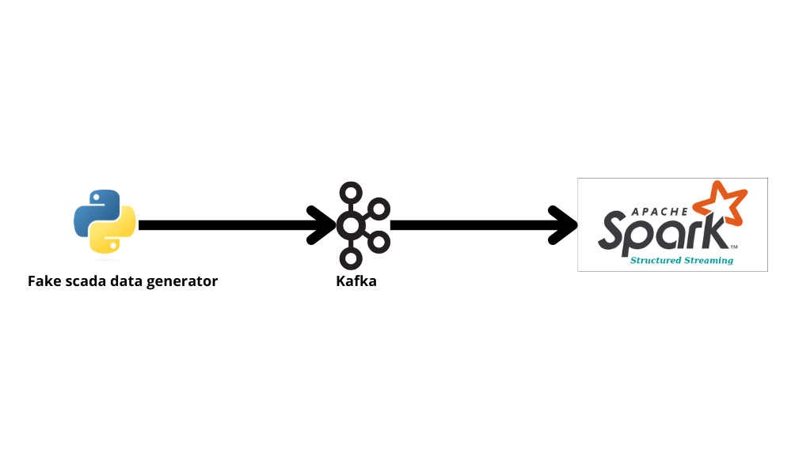

# SCADA Real Time Data Pipeline Project

## Overview

This project aims to simulate and analyze SCADA (Supervisory Control and Data Acquisition) data in real-time using a combination of FastAPI, Apache Kafka, and Apache Spark Structured Streaming. The architecture is designed to efficiently handle the generation, transmission, and analysis of streaming data.

## Project Components

- **Fake SCADA Data Generator (FastAPI):**
  - Generates synthetic SCADA data with dynamic parameters.
  - Exposes a streaming endpoint (`/generator/stream`) for real-time data access.

- **Kafka Producer:**
  - Bridges the FastAPI data generator and the Kafka messaging system.
  - Fetches simulated SCADA data and publishes it to a dedicated Kafka topic.

- **Apache Kafka:**
  - Serves as a distributed event streaming platform.
  - Provides the messaging backbone for communication between components.

- **Spark Structured Streaming:**
  - Subscribes to the Kafka topic for real-time data processing.
  - Performs data transformations and analytics using Spark's structured streaming.

## Project Structure

```plaintext
project-root/
│
├── fake-data-generator/
│   └── fake_data_generator.py
│
├── kafka-producer/
│   └── producer.py
│
├── spark-streaming-analysis/
│   └── analysis.py
│
└── README.md
```


## How to Run

1. **Clone the Repository:**
   ```bash
   git clone https://github.com/mbahraoui/SCADA-RealTime-Data-Pipeline.git
   cd SCADA-RealTime-Data-Pipeline
   ```

2. **Run Zookeeper and kafka **
   ```bash
   ~/kafka_2.13-3.5.0/bin/zookeeper-server-start.sh ~/kafka_2.13-3.5.0/config/zookeeper.properties
   ~/kafka_2.13-3.5.0/bin/kafka-server-start.sh ~/kafka_2.13-3.5.0/config/server.properties
   ```

3. **Run the Fake SCADA Data Generator:**
   ```bash
   uvicorn fake_data_generator:app --reload
   ```

4. **Run the Kafka Producer:**
   ```bash
   python producer.py
   ```

5. **Submit Spark Structured Streaming Analysis:**
   ```bash
   spark-submit --packages org.apache.spark:spark-sql-kafka-0-10_2.12:3.4.1 analysis.py
   ```

## Architecture



*Caption: The architectural diagram illustrates the flow of data from the Fake SCADA Data Generator to Kafka and Spark Structured Streaming for real-time analysis.*


